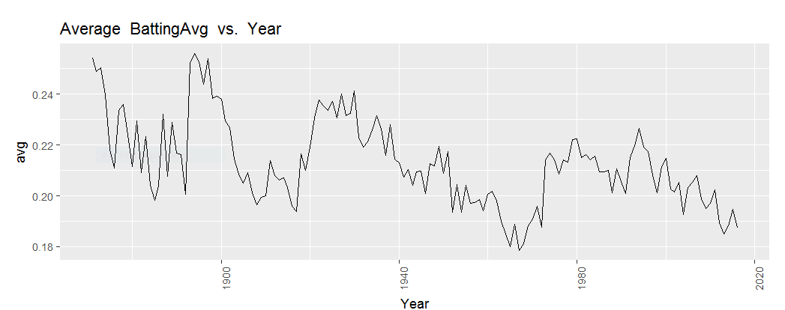
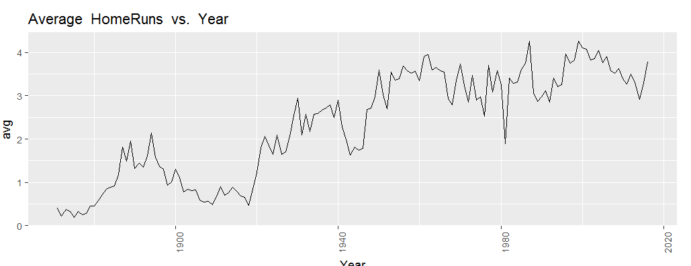
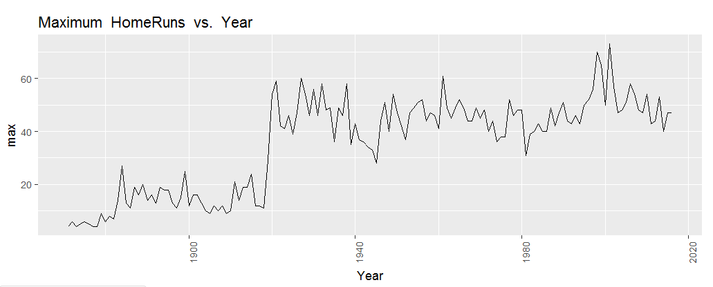
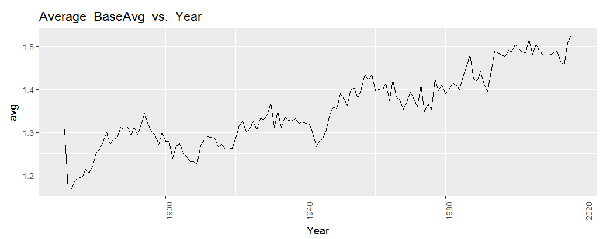
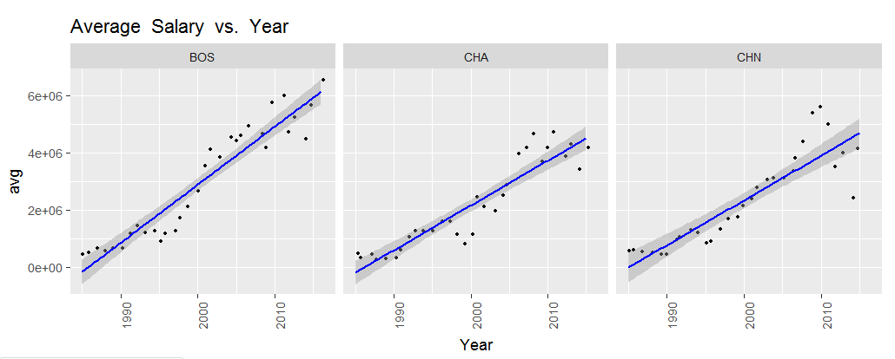
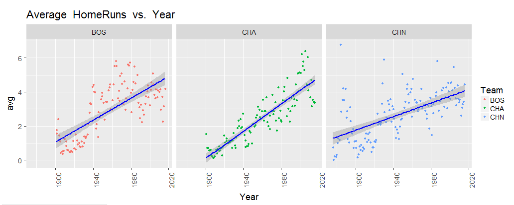
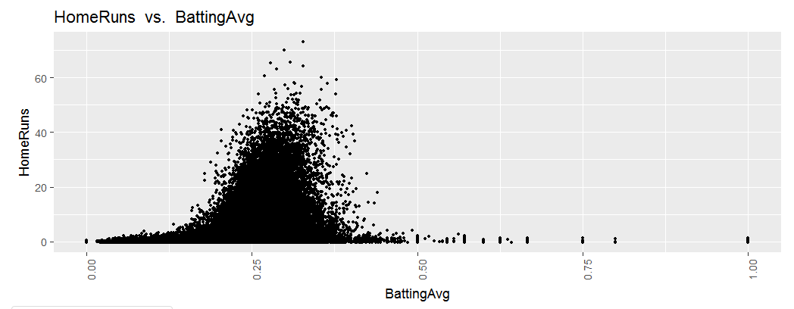

```{r}
library(tidyverse)
library(lazyeval)
library(dplyr)
```

#Abstract:
The goal of this project is to leverage the historical baseball data set cultivated by Sean Lahman to allow users to interactively discover relationships and trends, particularly due to rules and cultural changes to the game. This was accomplished via exploratory data analysis which was aimed at what we considered to be the dependent variables in the tables: home runs, batting average, salary, stolen bases, etc which we believed would be most likely to reflect changes. Following the exploratory phase, we recognized the breadth of data available and developed an interactive shiny plotting application which allows users to join relational tables together and manipulate the data.

#Overview and Motivation:
We had a very large and complete data set which spanned the entirety of the modern MLB era dating back to the late 1800s. Given this large set we set out to seek novel findings or trends that have occurred during the existence of MLB. We began by considering important explanatory variables in baseball such as batting averages, home runs, ERA, and stolen bases, and see if we could identify changes over time and relate them to the overall development of baseball. Because of the enormous amounts of statistics related to baseball, it was very difficult to come up with direct explanations or create predictions. We decided the best route to take would be to create a shiny app that allows users to compare different baseball data sets over time. As a group, we made it our goal to be able to model historical trends and rule changes that have occurred throughout baseball. Our data sets help explain important developments in Major League Baseball, such as shifts from small ball to power hitting, or changes in power hitting due to potential steroid use.

#Related Work and Inspiration:
We thought our idea was similar to the gapminder website. Users can take a look at huge variety of data sets to explore whatever aspect interests them. However our personal inspiration came from analyzing historical changes in baseball over time and using statistics to support them.

#Initial Questions:
What rules have changed over time in baseball and how have they affected how the game is played. Explain this through statistics.
How has the way in which the game is played changed over time. For example, how has the emphasis on say power hitting, small ball, or pitching changed over time.

#Exploratory Data Analysis:

```{r}
file_name <- '../data/Batting.csv'

batting_data <- read_csv(file_name)

```

This was used to create a few new potentially intersting variables. Doesn't need to be run now.
```{r}
#batting_data <- batting_data %>% mutate(BattingAvg = `Hits`/`AtBats`)
#batting_data <- batting_data %>% mutate(`Singles` = `Hits` - `Doubles` - `Triples` - `HomeRuns`,
#                        SluggingAvg = (`Singles` + `Doubles`*2 + `Triples`*3 + `HomeRuns`*4)/`AtBats`,
#                        BaseAvg = (`Singles` + `Doubles`*2 + `Triples`*3 + `HomeRuns`*4)/`Hits`)
#write_csv(batting_data, "../data/Batting.csv")
```

Quick look at computing slugging average and base average. Base average was a new idea we thought of which is slugging average without considering at bats. This value then does not reflect hit rate at all, just success on each hit.

```{r}
ggplot(data = batting_data) +
  geom_jitter(mapping = aes(x=Year, y=BattingAvg))
```


It appears there isn't really a trend between year and batting average as the values are very erratic. 

```{r}
#This was done as a test for passing variable as columns/values
group <- "Year"
col <- "HomeRuns"
sum_data <- batting_data %>% group_by(Year) %>% summarise(avg_hr = mean(HomeRuns, na.rm=TRUE), max_hr = max(HomeRuns, na.rm=TRUE))

lin_reg <- lm(avg_hr ~ Year, sum_data)
summary(lin_reg)

ggplot(data = sum_data) +
  geom_line(mapping = aes(x=Year, y=avg_hr)) +
  stat_smooth(method = "lm", col = "red", mapping = aes(x=Year, y=avg_hr))

ggplot(data = sum_data) +
  geom_line(mapping = aes(x=Year, y=max_hr))
```

There is a pretty consistent increase in home runs per person with a correlation of .78, so we feel like this is something to look more in to. COnsidering that the average does not take in to account the large number of players that play primarily defensive positions, we also chose to look at the maximum number of HRs per year. It turns out that there is a large cultural shift in the 1920's started by Babe Ruth and the outlawing of the spitball and other "freak delivery" pitches.

There is also a very big dip in 1980


```{r}
sum_data <- batting_data %>% group_by(Year) %>% summarise(avg_sb = mean(StolenBases))


ggplot(data = sum_data) +
  geom_line(mapping = aes(x=Year, y=avg_sb)) +
  stat_smooth(method = "lm", col = "red", mapping = aes(x=Year, y=avg_sb))
```


```{r}
sum_data <- batting_data %>% group_by(Year) %>% summarise(base_avg_avg = mean(BaseAvg, na.rm=TRUE),
                                                    slug_avg_avg = mean(SluggingAvg, na.rm=TRUE))

ggplot(data = sum_data) +
  geom_line(mapping = aes(x=Year, y=base_avg_avg)) +
  stat_smooth(method = "lm", col = "red", mapping = aes(x=Year, y=base_avg_avg))

ggplot(data = sum_data) +
  geom_line(mapping = aes(x=Year, y=slug_avg_avg)) +
  stat_smooth(method = "lm", col = "red", mapping = aes(x=Year, y=slug_avg_avg))
```

The same dip from above appears here in 1980/81 as well, as well as a dip from 1900-1920. We believe this is also explained by the splitball. The mean base average plot however shows that players were hitting harder than ever or achieving a better return for the same hit. Maybe running faster?

```{r}
file_name <- '../data/Salaries.csv'

sal_data <- read_csv(file_name)
```


```{r}
sum_data <- sal_data %>% group_by(Year) %>% summarise(avg_sal = mean(Salary), max_sal = max(Salary))

ggplot(data = sum_data) +
  geom_line(mapping = aes(x=Year, y=avg_sal)) +
  stat_smooth(method = "lm", col = "red", mapping = aes(x=Year, y=avg_sal))

ggplot(data = sum_data) +
  geom_line(mapping = aes(x=Year, y=max_sal))
```

The salary data we have is incredibly linear, much to our surprise. The data only goes back to 1985 so it's not as revealing as it may have otherwise been. The maximum is quite exponential and a factor of ~10 greater than the average.


```{r}
bat_sal_data <- inner_join(batting_data, sal_data, copy=TRUE)

ggplot(data = bat_sal_data) +
  geom_jitter(aes(x=BattingAvg, y=Salary))
```

As we assumed, it is very difficult to predict salary based on just one data point. Because of the multitude of positions in baseball and ways to perform without being awesome when at bat, one can command a high salary without batting well.


After this point, we had decided on developing the shiny application and used that for the rest of our exploratory analysis. These plots/app examples will be included in the final analysis as they pair together well.


#Final Analysis:
We looked through the history of baseball and its changes and tried to explain them using statistics from our app. We tried to analyze the changes over time, starting from the earliest rule changes. Some key findings were:

* Fouls count as strikes in 1903: 
    + Prior to 1903, batting averages were much higher because batters had more incentive to freely swing
    


* After 1920, there was a huge surge in home runs, and a large increase in ERAs for pitchers. This signaled the end of the   “dead ball” era where pitchers were able to dirty the ball which created inconsistent movements. We saw a huge shift           towards power hitting (Much more home runs) and less low base hits and steals.





* The trend from the mid 50s up until the early 2000s was to give the hitters more freedom to arguably create a more     entertaining game. The mound was lowered by 5 inches in 1969 giving hitters more time to react; designated hitters for pitchers were allowed in the American League in 1972 which brought a drastic and immediate increase in hits. This bullet point leverages the same plot as the first bullet.

* During the early 90s with the onset of Performance Enhancing Drugs, there was a huge boom in power hitting. Many players were getting over 40 home runs, and several players were breaking records (using PEDs).
    + In the early 2000s PED testing was enforced and the level of power hitting dropped off; since then there has been more of an emphasis on pitching
    


* Player salaries, although with statistics beginning in the 1980s, were surprisingly linear despite what seemed like exponential growth. The highest earners did grow at a higher rate, however.

#Shiny Application:
For the Shiny application, customization and freedom was our key goal. The number of tables and variables at our disposal was far too large for manual encoding, so the application is flexible to any number and types of tables, though we have gone through and cleaned up the naming convention for front end use and selected some default variables for tables when applicable. The application has the following features:

* Selecting any table, or two tables to be joined, for plotting and manipulation
* Refining the data selected to specific teams, players, or year ranges
* Summarising/Aggregating the data
* Display the data via a number of graph options
* Color and facet by variables in the chosen data set
* Perform linear regression of the chosen Y variable on the chosen X variable
* Hover over data points to allow for exploration
* Automatically generate information about the joins made
* Provide historical changes which can inspire the tools use

Here are some examples:

* Facet performance (home runs, salary, batting average) by team and see how they compare. Are some popular teams overpaying compared to their players' performance?





* Is batting average an indicator for home run performance? Do players who hit many home runs also have the ability to hit frequently or are hard hitting swings more difficult to hit?



